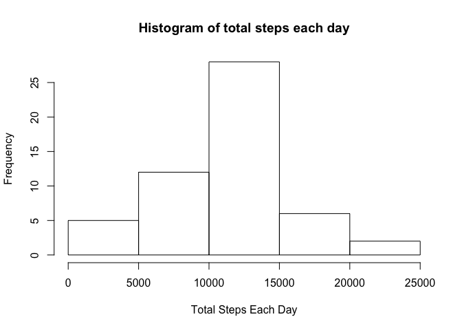
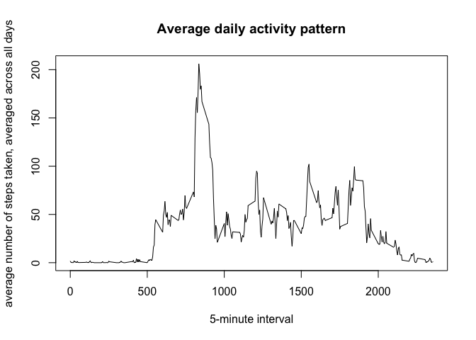
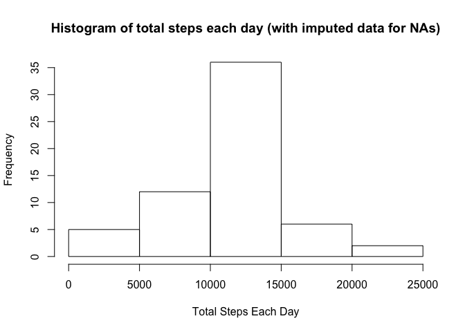
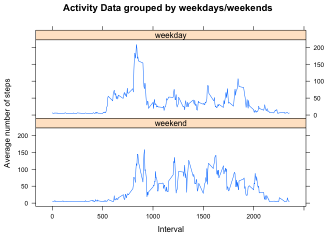

# knitrAssignment
Animesh Das  
10/23/2016  

*Note that Knit HTML function was run directly from RStudio, and the respective files were committed. Also, the figures are a part of the HTML file itself, since it has been encoded as Base64. The md file was generated using 'Output Options...' (next to Knit HTML dropdown) in RStudio, and the figures were then added by RStudio to a separate directory*


### 1. Code for reading in the dataset and/or processing the data

```r
url <-
    "https://d396qusza40orc.cloudfront.net/repdata%2Fdata%2Factivity.zip"
    currWd <- getwd()
    tempFile <- paste0(currWd, '/Activity.zip')
    download.file(url, destfile = tempFile, method = "curl")
    unzip(tempFile)
    file.remove(tempFile)
```

```
## [1] TRUE
```

```r
    setAs("character", "my-Date", function(from)
    as.Date(from, format = "%Y-%m-%d"))
```

```
## in method for 'coerce' with signature '"character","my-Date"': no definition for class "my-Date"
```

```r
    activityData <-
    read.csv(
    "activity.csv",
    header = TRUE,
    na.strings = 'NA',
    stringsAsFactors = FALSE,
    colClasses = c("numeric", "my-Date", "numeric")
    )
```

### 2. Histogram of the total number of steps taken each day

```r
totalStepsDaily <-
    aggregate(activityData[, c("steps")], by = list(activityData$date), sum)
colnames(totalStepsDaily) <- c('date', 'total.steps')
hist(totalStepsDaily$total.steps,
     xlab = 'Total Steps Each Day',
     main = 'Histogram of total steps each day')
```

<!-- -->

### 3. Mean and Median

#### Part 1

Displaying mean and median for the data-set used for the histogram plot above

```r
meanTotalSteps <- mean(totalStepsDaily$total.steps, na.rm = T)
medianTotalSteps <- median(totalStepsDaily$total.steps, na.rm = T)
```

Mean for the above histogram plot data-set is **1.0766189\times 10^{4}** and median is **1.0765\times 10^{4}**

#### Part 2

Also displaying total, mean and median on 'steps' grouped by each day, since I wasn't very clear on the question that asked to calculate mean and median values.

```r
library(plyr)
summarizedActivityData <- ddply(
    activityData,
    c("date"),
    summarise,
    total.steps    = sum(steps, na.rm = T),
    mean.steps = mean(steps, na.rm = T),
    median.steps   = median(steps, na.rm = T)
)
summarizedActivityData
```

```
##          date total.steps mean.steps median.steps
## 1  2012-10-01           0        NaN           NA
## 2  2012-10-02         126  0.4375000            0
## 3  2012-10-03       11352 39.4166667            0
## 4  2012-10-04       12116 42.0694444            0
## 5  2012-10-05       13294 46.1597222            0
## 6  2012-10-06       15420 53.5416667            0
## 7  2012-10-07       11015 38.2465278            0
## 8  2012-10-08           0        NaN           NA
## 9  2012-10-09       12811 44.4826389            0
## 10 2012-10-10        9900 34.3750000            0
## 11 2012-10-11       10304 35.7777778            0
## 12 2012-10-12       17382 60.3541667            0
## 13 2012-10-13       12426 43.1458333            0
## 14 2012-10-14       15098 52.4236111            0
## 15 2012-10-15       10139 35.2048611            0
## 16 2012-10-16       15084 52.3750000            0
## 17 2012-10-17       13452 46.7083333            0
## 18 2012-10-18       10056 34.9166667            0
## 19 2012-10-19       11829 41.0729167            0
## 20 2012-10-20       10395 36.0937500            0
## 21 2012-10-21        8821 30.6284722            0
## 22 2012-10-22       13460 46.7361111            0
## 23 2012-10-23        8918 30.9652778            0
## 24 2012-10-24        8355 29.0104167            0
## 25 2012-10-25        2492  8.6527778            0
## 26 2012-10-26        6778 23.5347222            0
## 27 2012-10-27       10119 35.1354167            0
## 28 2012-10-28       11458 39.7847222            0
## 29 2012-10-29        5018 17.4236111            0
## 30 2012-10-30        9819 34.0937500            0
## 31 2012-10-31       15414 53.5208333            0
## 32 2012-11-01           0        NaN           NA
## 33 2012-11-02       10600 36.8055556            0
## 34 2012-11-03       10571 36.7048611            0
## 35 2012-11-04           0        NaN           NA
## 36 2012-11-05       10439 36.2465278            0
## 37 2012-11-06        8334 28.9375000            0
## 38 2012-11-07       12883 44.7326389            0
## 39 2012-11-08        3219 11.1770833            0
## 40 2012-11-09           0        NaN           NA
## 41 2012-11-10           0        NaN           NA
## 42 2012-11-11       12608 43.7777778            0
## 43 2012-11-12       10765 37.3784722            0
## 44 2012-11-13        7336 25.4722222            0
## 45 2012-11-14           0        NaN           NA
## 46 2012-11-15          41  0.1423611            0
## 47 2012-11-16        5441 18.8923611            0
## 48 2012-11-17       14339 49.7881944            0
## 49 2012-11-18       15110 52.4652778            0
## 50 2012-11-19        8841 30.6979167            0
## 51 2012-11-20        4472 15.5277778            0
## 52 2012-11-21       12787 44.3993056            0
## 53 2012-11-22       20427 70.9270833            0
## 54 2012-11-23       21194 73.5902778            0
## 55 2012-11-24       14478 50.2708333            0
## 56 2012-11-25       11834 41.0902778            0
## 57 2012-11-26       11162 38.7569444            0
## 58 2012-11-27       13646 47.3819444            0
## 59 2012-11-28       10183 35.3576389            0
## 60 2012-11-29        7047 24.4687500            0
## 61 2012-11-30           0        NaN           NA
```

### 4. Time series plot of the average number of steps taken

```r
library(plyr)
meanStepsByInterval <- ddply(activityData,
                             c("interval"),
                             summarise,
                             mean.steps = mean(steps, na.rm = T))
plot(
    y = meanStepsByInterval$mean.steps,
    x = meanStepsByInterval$interval,
    type = 'l',
    xlab = '5-minute interval',
    ylab = 'average number of steps taken, averaged across all days',
    main = 'Average daily activity pattern'
)
```

<!-- -->

### 5. The 5-minute interval that, on average, contains the maximum number of steps

```r
maxSteps <- meanStepsByInterval[which.max(meanStepsByInterval$mean.steps),]
# displaying maxSteps$interval
```
From the above plot, the 5-minute interval that contains the maximum number of steps is **835**

### 6. Code to describe and show a strategy for imputing missing data

####  Total number of missing values in the dataset (i.e. the total number of rows with 𝙽𝙰s)

```r
totalNAs <- length(activityData$steps[is.na(activityData$steps)])
```

Total number of missing values **2304**

Percentage NA values that we see here is 

```r
percentNAs <- totalNAs/length(activityData$steps)*100
```

####  Imputing strategy for filling in all of the missing values in the dataset
We can use the *ifelse* function for our imputing strategy. We test each element of *steps* var here; if it is NA, we replace with the mean, otherwise we replace with the original value.

#### Create a new dataset that is equal to the original dataset but with the missing data filled in

```r
activityDataClean <-
    transform(activityData, steps = ifelse(is.na(steps), mean(steps, na.rm =
    TRUE), steps))
```

### 7. Histogram of the total number of steps taken each day after missing values are imputed

```r
totalStepsDailyImputed <-
    aggregate(activityDataClean[, c("steps")], by = list(activityDataClean$date), sum)
colnames(totalStepsDailyImputed) <- c('date', 'total.steps')
hist(totalStepsDailyImputed$total.steps,
     xlab = 'Total Steps Each Day',
     main = 'Histogram of total steps each day (with imputed data for NAs)')
```

<!-- -->

Displaying mean and median for the data-set used for the histogram plot above

```r
meanTotalStepsImputed <- mean(totalStepsDailyImputed$total.steps)
medianTotalStepsImputed <- median(totalStepsDailyImputed$total.steps)
```

Mean for the above histogram plot data-set is **1.0766189\times 10^{4}** and median is **1.0766189\times 10^{4}**

There is hardly any noticeable deviation from the mean, median values that were calculated in the first part of the assignment. Probably because the percentage of NAs is pretty less **13.1147541 %** and the fact that we substituted the NAs with the mean value!

### 8. Panel plot comparing the average number of steps taken per 5-minute interval across weekdays and weekends

```r
weekdays1 <-
    c('Monday', 'Tuesday', 'Wednesday', 'Thursday', 'Friday')
    #Use `%in%` and `weekdays` to create a logical vector
    #convert to `factor` and specify the `levels/labels`
    activityDataClean$wDay <-
    factor((weekdays(activityDataClean$date) %in% weekdays1),
    levels = c(FALSE, TRUE),
    labels = c('weekend', 'weekday')
    )
    
    AvgWDaySteps <-
    aggregate(activityDataClean[, c("steps")],
    by = list(activityDataClean$wDay, activityDataClean$interval),
    mean)
    colnames(AvgWDaySteps) <- c('wkday', 'interval', 'avg.steps')
    
    library(lattice)
    xyplot(
    avg.steps ~ interval | wkday,
    data = AvgWDaySteps,
    main = "Activity Data grouped by weekdays/weekends",
    xlab = "Interval",
    ylab = "Average number of steps",
    layout = c(1, 2),
    type = 'l'
    )
```

<!-- -->
